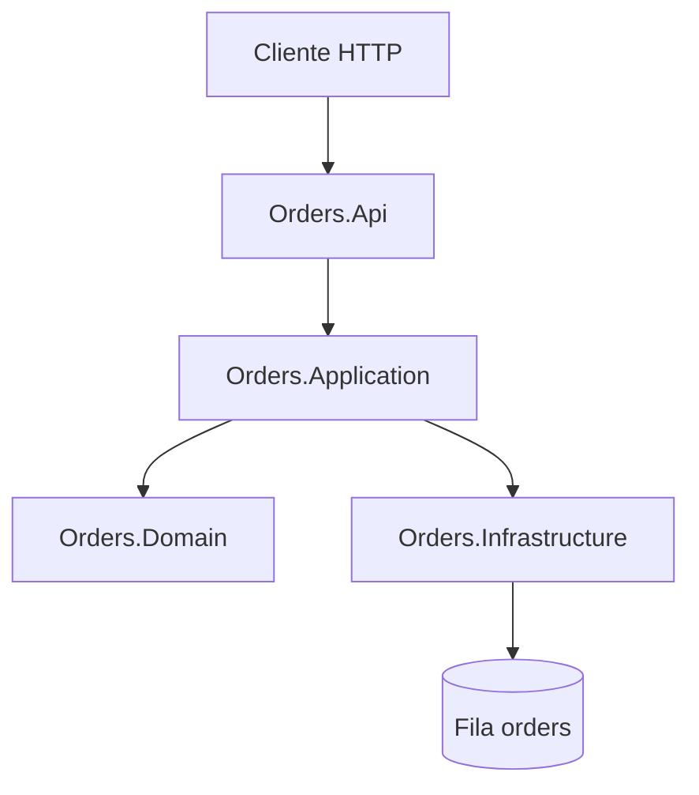

# Azure Service Bus Practice — API de Pedidos


Projeto didático que demonstra como uma API ASP.NET Core pode publicar e consumir mensagens em uma fila do Azure Service Bus.

O cenário representa o início de uma compra: a API recebe um pedido, aplica validações simples e publica um evento `OrderCreatedEvent` na fila `orders`. Para facilitar o estudo, o consumo da próxima mensagem é acionado manualmente por outro endpoint HTTP.

> Este projeto não processa pagamentos ou estoque e não utiliza banco de dados. O objetivo é isolar e compreender a integração com o Azure Service Bus.

## Fluxo da aplicação



1. `POST /api/pedidos` recebe os dados da compra.
2. A camada Application cria e valida o pedido.
3. Infrastructure serializa o evento e publica na fila `orders`.
4. O Azure Service Bus mantém a mensagem até o consumo.
5. `POST /api/pedidos/consumir-proxima` recebe e conclui uma mensagem.

## Tecnologias

- .NET 10;
- ASP.NET Core Web API;
- Azure Service Bus;
- `Azure.Messaging.ServiceBus` 7.20.2;
- Secret Manager do .NET;
- arquitetura em camadas.

## Estrutura da solução

```text
ASBus-Order-Practice/
├── src/
│   ├── Orders.Api/
│   │   ├── Controllers/
│   │   ├── Program.cs
│   │   └── appsettings.json
│   ├── Orders.Application/
│   │   ├── Abstractions/
│   │   ├── DTOs/
│   │   └── Services/
│   ├── Orders.Domain/
│   │   ├── Entities/
│   │   └── Events/
│   └── Orders.Infrastructure/
│       └── Messaging/
└── ASBus-Order-Practice.sln
```

| Projeto | Responsabilidade |
| --- | --- |
| `Orders.Domain` | Entidade de pedido, regras básicas e evento de domínio. |
| `Orders.Application` | Caso de uso, DTOs e contratos de publicação e consumo. |
| `Orders.Infrastructure` | Implementação da integração com o Azure Service Bus. |
| `Orders.Api` | Endpoints HTTP, configuração e injeção de dependência. |

As dependências apontam para o domínio. A camada Domain não conhece Azure, ASP.NET Core ou detalhes de persistência.

## Pré-requisitos

- uma assinatura Azure ativa;
- um namespace do Azure Service Bus;
- uma fila chamada `orders`;
- .NET SDK 10;
- Visual Studio 2022, Visual Studio Code ou outro editor;
- Postman, Insomnia, curl ou suporte a arquivos `.http`.

Confirme o SDK instalado:

```powershell
dotnet --version
```

## Preparar o Azure Service Bus

1. Acesse o [Portal Azure](https://portal.azure.com/).
2. Crie ou selecione um Resource Group.
3. Crie um namespace do Azure Service Bus.
4. Dentro do namespace, abra **Entidades → Filas**.
5. Crie uma fila chamada `orders`.
6. Para o teste local, abra **Políticas de acesso compartilhado** e copie uma connection string com permissão de envio e recebimento.

> A connection string é uma credencial. Não a coloque no `appsettings.json`, não a envie em mensagens e não a adicione ao Git.

## Configuração local

O `appsettings.json` mantém somente configurações que podem ser versionadas:

```json
{
  "Logging": {
    "LogLevel": {
      "Default": "Information",
      "Microsoft.AspNetCore": "Warning"
    }
  },
  "AllowedHosts": "*",
  "ServiceBus": {
    "ConnectionString": "",
    "QueueName": "orders"
  }
}
```

Armazene a connection string no Secret Manager:

```powershell
dotnet user-secrets init --project .\src\Orders.Api

dotnet user-secrets set `
  "ServiceBus:ConnectionString" `
  "COLE_SUA_CONNECTION_STRING" `
  --project .\src\Orders.Api
```

Confira se a configuração foi criada:

```powershell
dotnet user-secrets list --project .\src\Orders.Api
```

## Restaurar e executar

Na raiz da solução:

```powershell
dotnet restore
dotnet build
dotnet run --project .\src\Orders.Api --urls http://localhost:5054
```

A API estará disponível em:

```text
http://localhost:5054
```

## Endpoints

| Método | Endpoint | Resultado esperado |
| --- | --- | --- |
| `POST` | `/api/pedidos` | Cria o pedido, publica o evento e retorna `202 Accepted`. |
| `POST` | `/api/pedidos/consumir-proxima` | Consome uma mensagem e retorna `200 OK`; se a fila estiver vazia, retorna `204 No Content`. |

### Publicar um pedido

```http
POST http://localhost:5054/api/pedidos
Content-Type: application/json

{
  "cliente": "Walace",
  "produto": "Notebook",
  "quantidade": 1,
  "valorUnitario": 3500.00
}
```

Exemplo com PowerShell:

```powershell
$body = @{
  cliente = "Walace"
  produto = "Notebook"
  quantidade = 1
  valorUnitario = 3500.00
} | ConvertTo-Json

Invoke-RestMethod `
  -Method Post `
  -Uri "http://localhost:5054/api/pedidos" `
  -ContentType "application/json" `
  -Body $body
```

Uma resposta de sucesso deve utilizar o status `202 Accepted` e apresentar os dados do pedido criado.

### Conferir no Portal Azure

Depois da publicação:

1. abra o namespace do Service Bus;
2. entre em **Entidades → Filas → orders**;
3. confirme que a quantidade de mensagens ativas aumentou;
4. opcionalmente, utilize o **Service Bus Explorer** com a operação **Peek** para visualizar a mensagem sem removê-la.

### Consumir a próxima mensagem

```http
POST http://localhost:5054/api/pedidos/consumir-proxima
```

Ou com PowerShell:

```powershell
Invoke-RestMethod `
  -Method Post `
  -Uri "http://localhost:5054/api/pedidos/consumir-proxima"
```

O consumidor utiliza o modo `PeekLock`:

- `ReceiveMessageAsync` recebe e bloqueia temporariamente a mensagem;
- `CompleteMessageAsync` confirma o processamento e remove a mensagem;
- `AbandonMessageAsync` devolve a mensagem à fila quando ocorre uma falha.

## Validações do pedido

O domínio impede a criação de pedidos inválidos:

- cliente obrigatório;
- produto obrigatório;
- quantidade maior que zero;
- valor unitário maior que zero.

O valor total é calculado por:

```text
ValorTotal = Quantidade × ValorUnitario
```

## Fila e tópicos

Este exemplo publica diretamente em uma fila. Cada mensagem deverá ser processada por apenas um consumidor.

Para distribuir o mesmo evento a consumidores independentes, o Azure Service Bus oferece **Topics + Subscriptions**. Os filtros das subscriptions cumprem parte do papel exercido por bindings e exchanges em soluções RabbitMQ.

## Problemas comuns

| Problema | Possível solução |
| --- | --- |
| `ECONNREFUSED` | Confirme que a API está executando e que a porta é `5054`. |
| `404 Not Found` | Confirme a rota do controller e a presença de `AddControllers()` e `MapControllers()`. |
| `MessagingEntityNotFound` | Confirme que `QueueName` é `orders` e que a fila existe no namespace correto. |
| `Unauthorized`, `401` ou `403` | Revise a connection string e as permissões da política de acesso. |
| A mensagem reaparece | O processamento falhou ou o lock expirou antes de `CompleteMessageAsync`. |
| A fila permanece vazia | Confirme o retorno `202` e se a aplicação aponta para o namespace correto. |
| Push bloqueado pelo GitHub | Remova a credencial do arquivo e de todos os commits antes de tentar novamente. |

## Limitações intencionais

Para manter o exemplo simples, o projeto não possui:

- banco de dados;
- autenticação da API;
- processamento real de pagamento ou estoque;
- Worker Service separado;
- Docker ou pipeline de CI/CD;
- observabilidade e retentativas personalizadas.

## Evolução para produção

Em uma aplicação real, considere:

- persistir o pedido e aplicar o Outbox Pattern;
- executar o consumidor em um `Worker Service` ou `BackgroundService`;
- usar Microsoft Entra ID e RBAC no lugar de connection strings;
- atribuir `Azure Service Bus Data Sender` ao produtor;
- atribuir `Azure Service Bus Data Receiver` ao consumidor;
- implementar idempotência para tolerar mensagens duplicadas;
- monitorar métricas, erros, tentativas e a Dead-letter Queue;
- adicionar logs estruturados e correlação pelo identificador do pedido;
- criar a infraestrutura com Bicep ou Terraform.

`RootManageSharedAccessKey` possui permissões amplas e não deve ser utilizado diretamente por uma aplicação em produção.

## Referências

- [Documentação do Azure Service Bus](https://learn.microsoft.com/azure/service-bus-messaging/)
- [Enviar e receber mensagens de filas com .NET](https://learn.microsoft.com/azure/service-bus-messaging/service-bus-dotnet-get-started-with-queues)
- [ServiceBusClient — API .NET](https://learn.microsoft.com/dotnet/api/azure.messaging.servicebus.servicebusclient)
- [Secret Manager no ASP.NET Core](https://learn.microsoft.com/aspnet/core/security/app-secrets)
- [Azure.Messaging.ServiceBus no NuGet](https://www.nuget.org/packages/Azure.Messaging.ServiceBus/)
